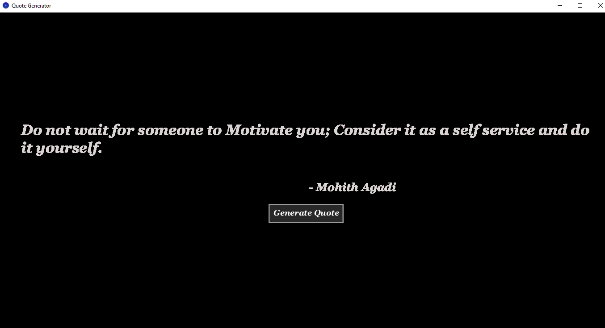

# random-quote-generator
Display quote and author by fetching from local csv file

# 🧠 Random Quote Generator

A simple **Random Quote Generator** built with Processing Java.  
When the user clicks a button, the program fetches a **random quote** from a **local CSV file** and displays it on the screen.

---

## ✨ Features
- 🎲 Displays a random quote every time the button is clicked  
- 📂 Reads quotes and authors from a local `quotes.csv` file  
- 🧩 Simple and clean user interface  
- ⚡ Works offline

---

## 🛠️ Technologies Used
- **Processing (Java)** for UI and logic  
- **CSV data handling** for storing quotes  

---
## ⚙️ How It Works
1. The program loads all quotes from `quotes.csv` during startup.  
2. When the **“Generate Quote”** button is clicked:  
   - A random quote is selected.  
   - The quote and author are displayed on the screen.
     
---
## 🖼️ Preview

---

